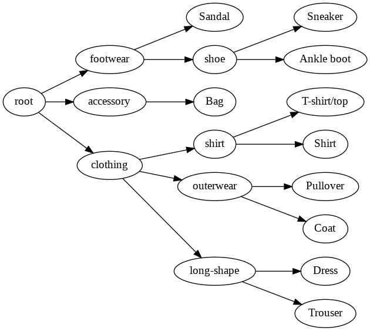
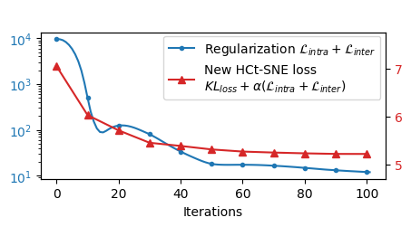

# HCt-SNE: Hierarchical Constraint with t-SNE

## Requirements

```
anytree==2.8.0
openTSNE==0.4.1
scikit-learn>=0.22.0
umap-learn>=0.3.10
tensorflow>=2.0.0 # for using keras dataset
```

Install all requirements: `pip install -r requirements.txt`

If using [colab environment](https://colab.research.google.com/), we only need to install two packages `anytree` and `openTSNE`.

HCt-SNE is compared with:
+ The original t-SNE (using openTSNE) [1]
+ UMAP [2]
+ cat-SNE [3]

References:

> [1] Policar, P. G., Strazar, M., & Zupan, B. (2019). openTSNE: a modular Python library for t-SNE dimensionality reduction and embedding. BioRxiv, 731877. (with [source code on github](https://github.com/pavlin-policar/openTSNE))

> [2] McInnes, L., Healy, J., & Melville, J. (2018). Umap: Uniform manifold approximation and projection for dimension reduction. arXiv preprint arXiv:1802.03426. (with [source code on github](https://github.com/lmcinnes/umap))

> [3] de Bodt, C., Mulders, D., López-Sánchez, D., Verleysen, M., & Lee, J. A. (2019). Class-aware t-SNE: cat-SNE. In ESANN (pp. 409-414). (with [source code on github](https://github.com/cdebodt/cat-SNE))

## How to Run

Command-line arguments for HCt-SNE (the version used for the paper)

```
$ python main.py -h

usage: main.py [-h] [--rerun0] [--rerun1] [--no-score]
               [--dataset_name DATASET_NAME] [--pca PCA] [-n N]
               [--margin MARGIN] [--seed SEED]

optional arguments:
  -h, --help            show this help message and exit
  --rerun0              Rerun original t-SNE
  --rerun1              Rerun new HCt-sne
  --no-score            Do not calculate metric scores
  --seed SEED, -s SEED  Random seed
  --dataset_name DATASET_NAME, -d DATASET_NAME
  --pca PCA             Run PCA on raw data
  -n N                  Number of dataset points
  --margin MARGIN, -m MARGIN
                        Relative margin in triplet loss

```

Default values for these arguments: `pca=0.95` (run PCA on the raw dataset to keep 95\% of the variance), `seed=2020` (if not set manually), `margin=0.5` (relative margin of 0.5).

For testing the method only, consider to run with `--no-score` option (without calculating the quality scores AUC[R_NX] and AUC[G_NN] since they are O(N^2 log N)).

Example: Run HCt-SNE for a subset of 10K of the CIFAR10 dataset

```bash
# run HCt-SNE with CIFAR10 (set -n 50000 for running with full dataset)
python main.py -d cifar10 -n 10000 --margin 0.5 --rerun0 --rerun1 --seed 2020
```

Run other methods (UMAP, cat-SNE) for comparison (using `compare.py` script)

```bash
# run UMAP with CIFAR10 (set -n 50000 for running with full dataset)
python compare.py -d cifar10 -n 10000 --method umap --seed 2020

# run cat-SNE for CIFAR10. This method is not optimized for large dataset,
# It can just be run with a subset of 10K points
# (and it takes around 1h30 in the colab environment.)
python compare.py -d cifar10 -n 10000 --method catsne --seed 2020
```

## Hyper-parameters

HCt-SNE uses the same hyper-parameter of tSNE (for creating the initial embedding) without exaggeration phase.

```python
tsne_kwargs = dict(
    perplexity=50,
    random_state=2020,
    initialization = "pca", # change it to `random` for running different times
    negative_gradient_method = "bh", # use Barnes-Hut acceleration
    learning_rate = "auto", # will be set to N/12
    early_exaggeration = 12,
    early_exaggeration_iter = 250,
    theta=0.5, # parameters for Barnes-Hut tree
}
```

HCt-SNE implements a new objective function `my_kl_divergence_bh` and injects into the optimization loop of openTSNE.

```python
hctsne_kwargs = dict(
    ..., # the same arguments as t-SNE as above

    # disable exaggeration
    early_exaggeration = 0,
    early_exaggeration_iter = 0,

    # new objective function that takes
    # the hierarchical constraints in `tree_regularizer`
    negative_gradient_method=partial(
        my_kl_divergence_bh,
        list_regularizers=[(alpha, tree_regularizer)],
        logger=loss_logger,
    )
)
```

The `alpha` hyper-parameter for each dataset can be easily tuned by choosing the value that makes the new objective function decrease.
In the paper, `alpha=7.5e-4` for MNIST and Fashion-MNIST and `alpha=5e-3` for CIFAR10.

<div style="page-break-after: always"></div>

## Results

### Visualization with the subset of 10K for each dataset


<!-- 
|   | MNIST | Fashion-MNIST | CIFAR10|
|:-:|:-----:|:-------------:|:------:|
|t-SNE||||
|cat-SNE||||
|UMAP||||
|HCt-SNE||||
|Hierarchy||||
|Loss||||
---
 -->

<div style="page-break-after: always"></div>

### Visualization with full datasets

We use the full training set of each dataset (60K for MNIST, 60K for Fashion-MNIST and 50K for CIFAR10). (The test set is reserved for testing the embedding with new points -- not presented in this version).
cat-SNE cannot run with the full dataset.


<div style="page-break-after: always"></div>

### Quality Metrics

Average scores of different metrics for three datasets (on the subset of 10K data points) are shown in the following figure.

Each methods are run 10 times with different random initializations.
The scores are calculated for each resulting visualizations.
The mean values are reported in the bar chart, the standard deviations are shown in the black error bars.
Note that the scores are stable and thus the standard deviations are small.


The two quality metrics AUC[R_NX] and AUC[G_NN] are detailed here:


<div style="page-break-after: always"></div>

### Effect of Relative Margin

With different values of the relative margin, we obtain different visualizations.
Large margin forces the groups to be more concentrated.
(In the paper, we use the relative margin of 0.5.)

